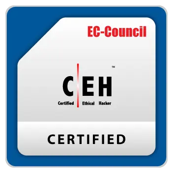
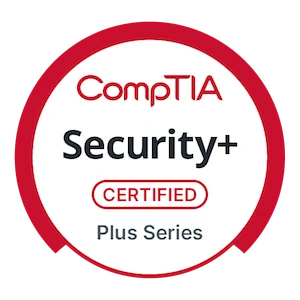
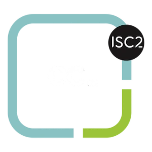

# Hi there 👋 

## I'm **Mohammed Afnaan Ahmed**

- I'm either building stuff, breaking said stuff, or doing both! 🔨
- I share quality content about Cyber Security on Linkedin and Medium. 
- I write articles and build tools related to offensive security. 🛠

 

---

## 🌐 My Website

- [Afnaan.me](https://afnaan.me) - My secure-by-design portfolio website. ✨
   
---

## 🏆 Certifications 

    
    
    

  

---

## 📈 Stats

---

## 👨‍💻 Technical Skills

----

## 🤝 Find me here

[Linkedin](https://linkedin.com/in/afnaan-ahmed-2180)

[Medium](https://medium.com/@afnaan2180)

[TryHackMe](https://tryhackme.com/p/0v3rH4uL)

[X](https://twitter.com/afnaan2180/)

 

---

Thanks for stopping by! Let’s build a secure digital world! 😊
